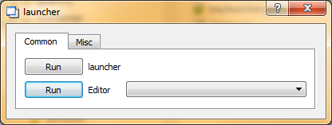

# Readme for traylauncher 

## Purpose
traylauncher is a small application to run a set of programs by a single 
button click. Several program sets could be configured and assigned to a button.
The buttons may be organized in several tabs. Configuration means if some files
could be dragged to a button, if these files should be stored in a history and
also the position and size of the programs in a set.

## Requirements
- Python 3.2. Other versions may work but are not tested.
- PyQt4 
- PyWin32
- Windows XP, Windows 7

## Configuration
traylauncher reads a `config.py` file at start up.
Here is a template:

    CONFIGLIST = [
        {"tabname" : "Common",
         "buttons" : [
            {"name":"launcher",
             "history": False,
             "draggable": False,
             "commands":[
                { "command": r"notepad.exe C:\projects\python\launcher\launcher.py",
                  "position": (0,0),
                  "size": (600, 400)
                } ,
                r"explorer.exe /root,C:\projects\python\launcher"
                ]
            },
            {"name":"Editor",
             "history": True,
             "draggable": True,
             "commands":[r"notepad.exe"]
            },
            ]
        },
        {"tabname" : "Misc",
         "buttons" : [
            {"name":"Test 1",
             "history": True,
             "draggable": True,
             "commands":["notepad.exe", "explorer.exe"]
            },
            {"name":"Test 2",
             "history": False,
             "draggable": True,
             "commands":["notepad.exe", "explorer.exe"]
            },
            ]            
         },
    ]
    
And here is the corresponding screenshot:

        

## Files
- `traylaucher.py` -- The traylaucher script
- `traylaucher.pyw` -- To run traylaucher script without console
- `icon_16x16.png` -- program icon
- `icon_64x64.png` -- program icon
- `config.template` -- configuration template
- `Readme.md` -- this file
- `licence.txt` -- the BSD licence for this software